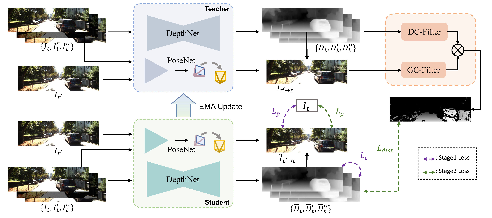

# EC-Depth
The official Pytorch implementation of the paper:
> **EC-Depth: Exploring the consistency of self-supervised monocular depth estimation under challenging scenes**
>
> *Ruijie Zhu, Ziyang Song, Chuxin Wang, Jianfeng He, Tianzhu Zhang*

[](https://arxiv.org/abs/2310.08044)
[](https://ruijiezhu94.github.io/ECDepth_page/)

[](https://paperswithcode.com/sota/unsupervised-monocular-depth-estimation-on-7?p=ec-depth-exploring-the-consistency-of-self)


<p align="center">

</p>

> The two-stage training framework of EC-Depth. In the first stage, we train DepthNet and PoseNet with the perturbation-invariant depth consistency loss. In the second stage, we leverage the teacher network to generate pseudo labels and construct a distillation loss to train the student network. Notably, we propose a depth consistency-based filter (DC-Filter) and a geometric consistency-based filter (GC-Filter) to filter out unreliable pseudo labels.

## News
- **16 Dec. 2023**: The code is now available.
- **28 Nov. 2023**: The [project website](https://ruijiezhu94.github.io/ECDepth_page/) was released.
- **12 Oct. 2023**: [EC-Depth](https://arxiv.org/abs/2310.08044) released on arXiv. 

## Installation
Please refer to [dataset_prepare.md](./docs/dataset_prepare.md) for dataset preparation and [get_started.md](./docs/get_started.md) for installation.

## Running

We provide example bash commands to run training or testing. Please modify these files according to your own configuration before running.

### Training

First stage training:

```bash
bash train_first_stage.sh train first_stage_model 2 4 
```
Second stage training:

```bash
bash train_second_stage.sh train second_stage_model 2 4 
```

### Testing

Evaluate the model on KITTI dataset：

```bash
bash evaluate_kitti.sh
```

Evaluate the model on KITTI-C dataset：

```bash
bash evaluate_kittic.sh
```

## Results
We provide the official weights of EC-Depth (the first stage model) and EC-Depth* (the second stage model) on [Google Drive](https://drive.google.com/drive/folders/1UCmVxb640s4xukMyGZx5ib67SQgpmquI?usp=drive_link). Their experimental results on KITTI and KITTI-C are as below. 

### KITTI
| Methods  | AbsRel  | SqRel  | RMSE  | RMSE log  | a1  | a2  | a3  |
| :----: | :----: | :----: | :----: | :----: | :----: | :----: | :----: |
| EC-Depth  | 0.100 | 0.708 | 4.367 | 0.175 | 0.896 | 0.966 | 0.984 |  |
| EC-Depth*  | 0.100 | 0.689 | 4.315 | 0.173 | 0.896 | 0.967 | 0.985 |

### KITTI-C
| Methods  | AbsRel  | SqRel  | RMSE  | RMSE log  | a1  | a2  | a3  | 
| :----: | :----: | :----: | :----: | :----: | :----: | :----: | :----: |
| EC-Depth  | 0.115 | 0.841 | 4.749 | 0.189 | 0.869 | 0.958 | 0.982 |  |
| EC-Depth*  | 0.111 | 0.807 | 4.651 | 0.185 | 0.874 | 0.960 | 0.983 |

## Bibtex

If you find our work useful in your research, please consider citing:

```
@article{zhu2023ecdepth,
  title={EC-Depth: Exploring the consistency of self-supervised monocular depth estimation under challenging scenes},
  author={Zhu, Ruijie and Song, Ziyang and Wang, Chuxin and He, Jianfeng and Zhang, Tianzhu},
  journal={arXiv preprint arXiv:2310.08044},
  year={2023}
}
```

## Acknowledgements

The code is based on [MonoDepth2](https://github.com/ldkong1205/RoboDepth), [MonoViT](https://github.com/zxcqlf/MonoViT), and [RoboDepth](https://github.com/ldkong1205/RoboDepth). 